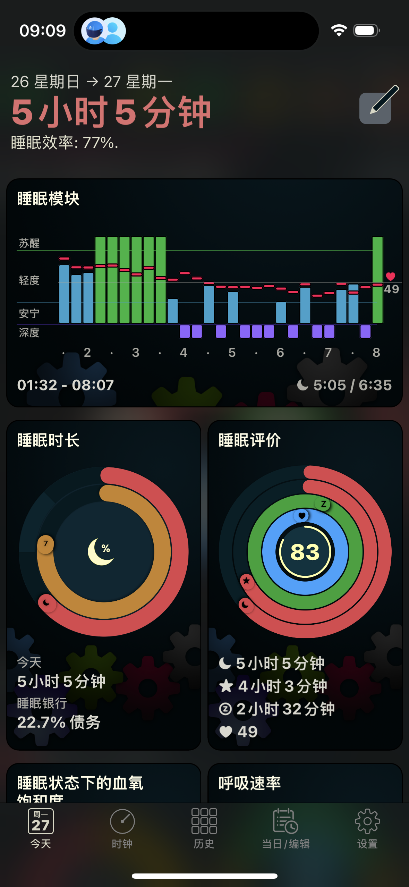
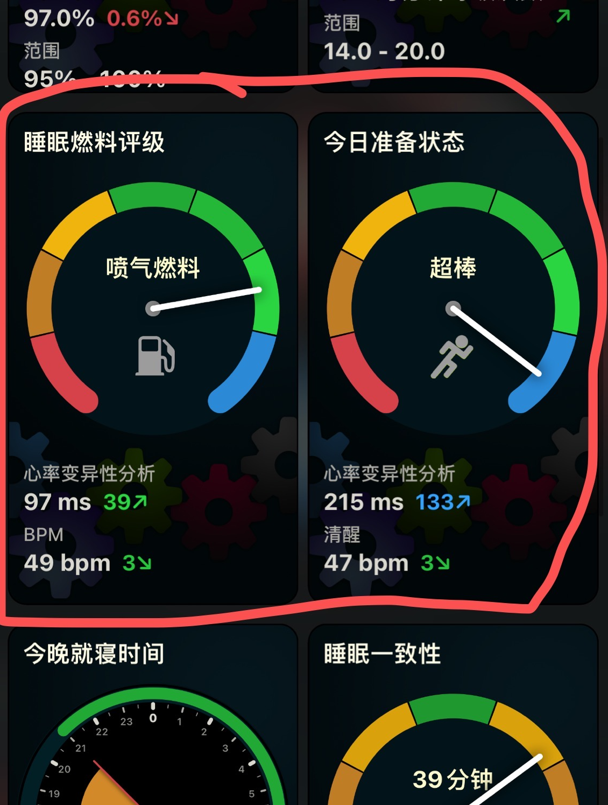
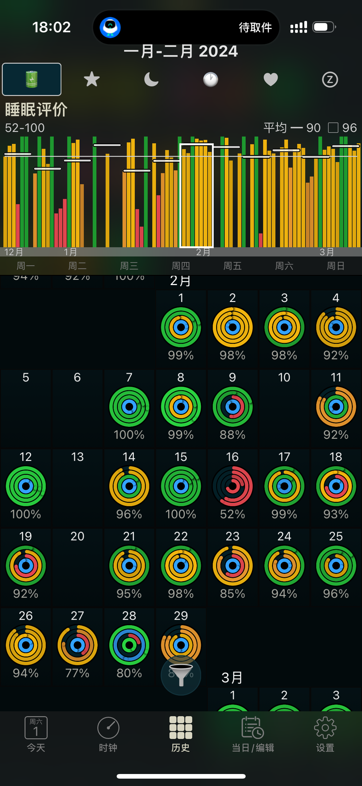
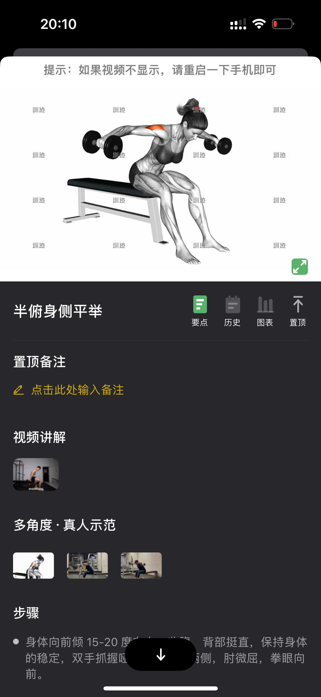
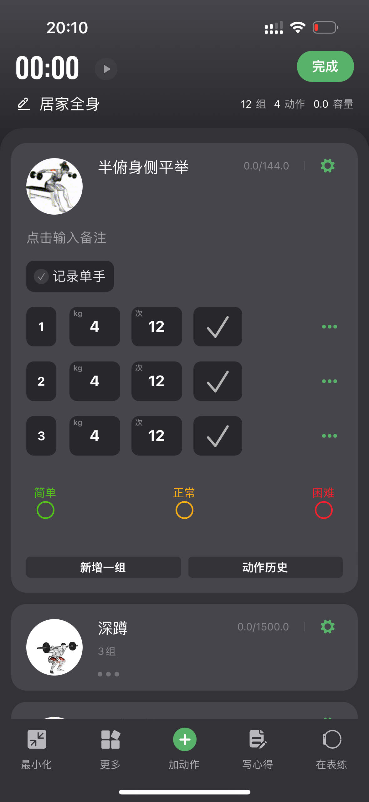
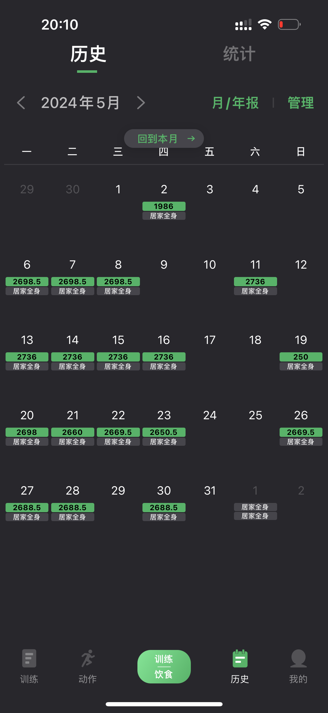

# 千千的用户体验报告（AutoSleep、训记、多邻国、Grow）+作为体验用户体验Moodji后的建议

全文分三个部分：

- 背景：描述了我和这4+1款软件的关系
- 用法：描述了我使用这4款App的场景和我认为的App亮点
- 建议：横向对比4款产品和Moodji后，我作为体验用户对Moodji的建议

## 背景

#### 我和这四款App的关系（AutoSleep、训记、多邻国、Grow）

在加入Moodji团队之前，我是这4款App的用户，也开通了除Grow外其他三款软件的付费会员，AutoSleep


我将根据我自身在这4+1软件中的体验，提供我个人视角下的看法，最后给出我作为Moodji体验用户的产品建议，希望能为Moodji的发展带来参考。

## 你最经常使用这些App的哪些功能，在什么场景下使用？

##### AutoSleep（只使用手机端）



```
场景一：我几乎每天早晨醒来的第一件事儿就是看AutoSleep的睡眠评价圆环，我会综合我的精神状态和AutoSleep的睡眠圆环预估今天的精神状态。（比如：一次质量差且时长不足的睡眠的第二天如果我会想更多方案来帮助我获取能量（比如喝咖啡、比如多午睡一会，比如多做自己肌肉记忆的事儿，少去思考困难的问题））。
场景二：早晨醒来除了会查看睡眠圆环之外，我多数时候还会瞟一眼睡眠燃料评级和今日准备状态，我会希望它是「喷气燃料」和「超棒」，我会觉得这可能会对我进行一些好的心理暗示以帮助我更具有思维活力
场景三：我会不定期查看我的「睡眠信用/睡眠债务」，如果睡眠信用比较多，我会允许自己适当熬熬夜，如果睡眠债务比较多我会让自己近期早点睡。
场景四：长期来看，可以以月为单位看到每天的圆环，这对于我做中长期规划或者相对较大的决策很有帮助。例如：在一个没有价值感还有很大压力的岗位上工作，几乎能看到大量的「低质量睡眠圆环」（睡眠时间长但深度睡眠不足）或「低时长低质量睡眠圆环」（睡眠时间不足，深度睡眠时间不足）。以月为单位的表格里除了提供每日圆环之外，还有每日的睡眠助状态，相比睡眠圆环，可以更直观的看到这个月的每一周睡的怎么样.
```

##### 训记（只使用手机端）



```
场景一：这款软件帮助我记录自己的深蹲重量、卧推重量，组数等，还会帮我的组间休息进行计时，每天练哪些动作，加多重的片，什么时候开始下一组，需要做几组，他都会帮我完成。——在我不知道这款软件之前我是带着这样一个A4的纸夹子+iPhone的计时器完成这些的。
场景二：因为需要对身体不同部位的肌肉进行训练，所以尝试新动作的时候，我会希望得到一个相对专业的指导，他的视频指导成了我这种不愿意付费请教练指导的平替
场景三：以月为单位看到自己每月健身了多少天，每周健身了多少天会让我感觉到自己的身体在持续变的强壮，对我是一种鼓励，会增强我的信心和配得感。
```

##### 多邻国（只使用手机端）

```
场景一：养成了上下班坐地铁的时候去刷题的习惯，基本上不是特别拥挤的通勤我都会刷多邻国
场景二：每周日是段位的结算日期，所以周六和周日会为了达到更高段位或者守住自己的高端位而拿出更多时间刷题
```

##### Grow（只使用手表端的实时hrv提醒）

```
我有时候长时间陷入焦虑或高压而自己注意不到，这时候如果他发现了我hrv的变化，告诉我注意压力，我会开始反问自己：我现在压力大吗。——这有点类似于心理医生让焦虑症患者每天记录自己的心情和情绪状态（目的也是让患者提出问题：我现在感到焦虑吗——因为解决焦虑的一个非常好的办法就是发现自己处于焦虑状态）。
有时候它会弹窗告诉我元气满满，这个时候我会感受一下自己的精神状态——往往确实不错，那这个元气满满也会给我更好的心理暗示，让我的思维更加活跃。
```

## 你觉得这些软件中最吸引你的点是哪些，为什么这些点会吸引到你

##### AutoSleep

```
1. 每日睡眠圆环+颜色标识会带给我非常冲击的视觉体验，看一眼今天的睡眠圆环就知道自己昨晚睡的怎么样「相比我深度睡眠了几个小时，我更关心我睡的好不好」
2. 颜色和倾向性强绑定，蓝色就是非常好，绿色就是好，黄色就是还行，红色就是很差，无论是圆环还是柱状图还是色块，会很清晰的传递对睡眠整体的评价或者对其中某项的评价
3. 一屏幕展示一个月的数据，一次操作切换上月下月，
4. 整个软件专注于睡眠，偶尔我会看到苹果健康的睡眠中有来自AutoSleep的记录的我的午睡，会强化我对AutoSleep这个软件在睡眠领域更专业的认知。
5. 买断制，一次性付费获得终身使用权会让我这种定期盘点自己软件订阅的人在购买时感到安心。
```

##### 训记

```
1. 用最高效的方式记录训练过程————对我来说它的解决方案对标的是用备忘录打字记录或者用A4纸夹和笔+计时器记录
2. 很酷的动作指导——我可以看到正确的姿势、应该被训练到的目标肌群、真人的动作要领讲解以避免我借力或者受伤
3. 历史月报，看着自己每月点亮的日子会有成就感，当自己点亮的日子比较少的时候也是对自己的一个提醒，心理会隐隐告诉自己要多锻炼啦，不然这个月点亮的运动日会很少。
4. 买断制同上
```

##### 多邻国

```
1.本身学英语是强目标驱动，游戏化的设计理念放大了这种目标驱动，用「经验」量化了「学好英语」中学到的知识，用「关卡」将「学好英语」拆解为了一个可达成的目标（通关所有关卡）。（产品中所有游戏化的设计皆指向「学好英语」这一目标：1️⃣每周段位和经验排行榜（谁段位更高，经验更多——那他学的英语就越多）2️⃣每日任务是为了获取更多宝石和经验宝，而宝石而经验包最终目的指向获取更多经验，获取更多经验再指向「本周学了多少英语」）————游戏化设计理念在形式上可以理解为任务、积分、排行榜、成就、徽章等等。
2. 很多海外高校认可他的测试结果，这会让我觉得他在手机App学英语里是具有较高专业性的。
3. IP形象，Duo和拽姐配合小组件配合弹窗提醒 会有很高的识别度以及记忆点。
4. 轻社交里的互相庆贺，互相关注——会让我感受到同行者（我不是一个人在学语言），会让我获得来自真人的正反馈。
5. 人工编排的课程顺序和算法保证了闯关过程中既不会「总是轻松容易——没有收获」，又不会「总是困难重重——打击信心」。
6. 动画：无论是跳动的「晋级」按钮还是看着你做题时眨眼睛/晃脑袋的小人，会让我感觉到生动
7. 建立奖励的条件反射，小人会在你做对的时候给你一个微笑，每次做对时候的奖励音效
```


如果说AutoSleep的核心价值是：「改善睡眠质量」，训记的核心价值是「系统性锻炼」，那么多邻国的核心价值就是「提升英语水平」，那么我理解Moodji的核心价值可能是「让今天过的不错」。

## 作为体验了Moodji的用户，会对Moodji有哪些期待或者建议？

以下是我作为用户对Moodji的期待和建议

其中【🤔】标识表示没有想的很明白，但是愿意提出来有机会的话可以一起讨论下

其中【❓】标识表示我认为存在问题，但是目前没有想到更好的解决方案

#### 战略侧

1. 实时hrv+情绪记录

```
增加实时hrv提醒，但是提醒完之后允许用户修正结果（手表App或手机App），不断逼近用户的真实感受。手表的交互方式可以是类似PUBG中的直接划拉一下

我感受到了grow中实时hrv的价值，也理解苹果健康提供情绪记录尝试传递的价值，但我认为他们各有不足。
grow的「事实hrv」是单向的传递，而缺少了人和手表的互动，以至于数据无法成长，只能依靠苹果底层硬件，这对不同人的针对性不足。
苹果健康的「情绪记录」交互链路太长，记录一次情绪需要走过三四层NavigationLink。
```

2. 泛健康🤔

```
心情愉悦是否为「好的一天」
是否用药，是否摄入咖啡因，是否吸入尼古丁是否为「好的一天」
```

#### 数据侧

1. 将定义的「**好的一天**」清晰告诉用户如何达成

```
例如：达成「出门走走」=达成「出门走走」众多子状态的其中一种，而达成子状态又需要「步数活跃」>=2，那又如何达成「步数活跃」呢？这里中断了，我认为清晰的表达应该是出门散步超过10分钟即可达成「出门走走」状态————其中，您具体取得的状态可能为巴拉巴拉所有子状态
```

2. 取消「重度屏幕使用」状态 或 增加屏幕使用状态细分

```
「重度屏幕使用」是一个客观事实，抛开对眼睛的伤害，没有好坏之分，所以如果不是为了保护视力，那一定要拿到更具体的数据，是刷了1个小时抖音还是看了一个小时的书，这两者在用户看来还是有区别的。但如果是为了保护视力，那么一定要将价值传递给用户，例如监测到重度屏幕使用之后一句「眺望一下远方缓解一下视觉疲劳」或许会让用户感受到这件事儿的价值。
```

3. 睡眠质量低的情况下，酌情减少关于锻炼的得分上限

```
睡眠质量低的情况下，酌情减少关于锻炼的得分上限，将减少的上限增加到睡个好觉的奖励中去，但总量应当少于高睡眠质量+适当锻炼
```

4. 对专注的定义有问题❓

```
如果仔细我周日的数据，会发现40%的时间都是专注但实际上点开发现就是没数据，还有50%的时间是在屏幕重度使用，但实际上我在很专注的工作。这给我带来的体验是“我不再相信App的专注状态的标注”，我相信「屏幕重度使用」状态，但是却不觉得有什么不对。
```

#### Today页（含手机widget小组件）

1. Today页，直接显示「今日状态」而不是只有上小时状态（目前「状态记录页需要手动打开」）

```
但具体的布局方式还需要进一步设计（例如使用一个类似时钟的设计，给已经过去的小时填入颜色？）现在的状态记录页面也太长了，不到一天的记录竟然需要两个屏幕才能看完。我希望在今天的任意时刻都应该能看到今天过去的几个小时做了什么，还剩下几个小时可以是我可以控制的（我理解Moodji可能想传递的价值是：「今天过得怎么样/今天想过的怎么样」）
```

2. 分享页面允许不带格言出去

```
我认为分享页面的名人名言不是比较好的选项，或许可爱风/心态上的摆烂风/佛系/甚至是emo文案可能都比格言更好一些，或者至少允许我有选择不带格言出去的权利都会让我感觉更好一些
```

3. 关于手机小组件：我认为如果显示不了实时的状态，那么显示仪表盘的价值大于上个小时的。

### 活动页

1. 关于叶子的排行榜系统，捐献榜用当月获得的叶子排名

```
捐叶子证明我叶子多，叶子多证明我（生活方式更好/开通了VIP），这对于用户理解排行榜价值的链路有些长，应当缩短理解链路。
而对于爱心榜不用变动，爱心多证明我（有叶子且邀请了朋友一起追求更好的生活方式），但其实这里是我们的拉新逻辑，进行包装是对的（「邀请好友砍一刀」就是要比「拉新人来用App」好听很多）
```

2. 徽章系统提供更多代表真实价值的徽章

```
关于徽章系统：从目前的设计来看，只是成就系统的延伸，而不是真正有价值的徽章（这里可以参考多邻国：累积赚够了10000经验、完成150个学习单元、累积连胜365天。。。）————每一个徽章都从一定的维度标识着该用户语言学习的进展，所以希望Moodji的徽章标识的是我好好生活的天数或者其他维度（时间维度、数量维度），而对于标识着我曾经的排名的徽章或者拉新大王的徽章也可以保留但不能是重要的徽章（类似QQ飞车的车神榜和魅力榜————车神榜代表技术，魅力榜代表充值金额）。
```

3. 增加轻互动，轻社交

```
作为鼓励系统，例如，如果你累积完成了100天的每日状态全部点亮，将会把你推给好友甚至陌生人，他们可以点一下向你传递鼓励信号。（类似被点赞了）
```

4. 在涉及到他人信息的地方强化贴纸

```
例如：排行榜中的别人的用户昵称前面显示用户当前的状态（用那个人选中的贴纸呈现），或者关注列表里的他人信息页等等类似场景。

从商业化角度出发，应当强化贴纸在App中的呈现。只有贴纸被更多的人看到，皮肤的价值才会被升高（LOL真实买皮肤的人-用皮肤修改器的人 = 买皮肤是为了给别人看的人），贴纸才会被更多人追求。
```

5. 实体奖励【🤔】

```
如果每期排行榜的前几名能获得Moodji官方赠送的实体版贴纸，甚至是定制的每日日历、手机壳等，我认为能适当增加排行榜的吸引力，如果反响强烈甚至能联合实体的生活方式产品进一步扩大App/Moodji品牌在用户侧的影响力
```

#### 新用户引导页面

1. 新用户来到App后，拉长介绍各种色块和状态含义的周期。

```
关于色块含义的学习曲线应该循序渐进而不是一口气塞给用户，起初可以只介绍甚至只使用App最核心传递的价值的两到三个颜色，随着用户认知的到位，再解锁更多颜色，更多状态来减少用户的认知曲线陡峭程度，
```

2. 取消进入App的日程页面

```
关于介绍页面的日程，应该放在设置页的小入口里，长期观察到用户的数据和默认日程有不重合的地方再引导用户微调或者直接给出微调结果让用户确认更改即可。
对于熟知规则老用户可以引导他自己去设置页打开日程补充其他日程
```

3. 睡眠状态、活动状态介绍和能量条色块教学页

```
同时让用户看两个手表，不聚焦（如果采纳了仪表盘的设计，可以合并成一页通过动画的形式介绍仪表盘）——像PPT那样
```

4. 取消手表手机截图页

```
已经下载了你App的人证明已经经过了应用商店（至少扫过一眼你上传在AppStore的宣传页），并且愿意尝试，那么帮助他快速开始体会App的价值会比重复宣传App亮点更棒
```

### 周报页

1. 周报改成小格形状的**月报**

```
一张屏幕看到整个月每天分别做的怎么样，以及，既然App定义了「好的一天」，那我能否从月报中看到过去这一个月到底有「多好」或者「多不好」。（如果Today页采纳了类似仪表的设计，这里最简单的方案可以考虑将多个仪表一屏列出来）
```
