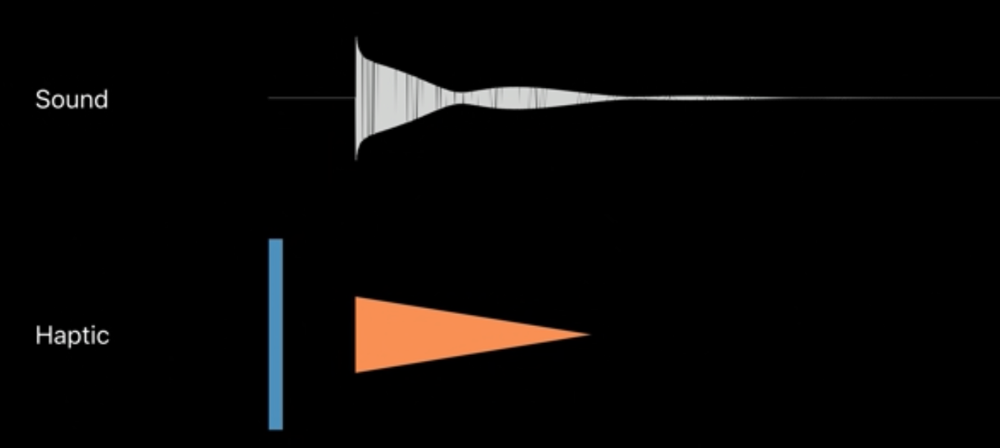

# 通过 Core Haptics 扩展感知体验

### What is an Audio Haptic experience?什么是音频触觉体验？

声音和力触觉会把你的App带到一个全新的高度，iOS提供了很多种类的有关触觉反馈的API供选择

### Three guiding principles 3个原则

- Causality因果关系

````
表明是谁导致了因果关系
声音、动画和震动同时协作，提供完整的体验，例如Apple pay的动画+声音+震动
````

- Harmony协调

```
视觉、听觉和震动三者应当协调
例如代表冥想呼吸的动画搭配的声音应当和代表鼓点的动画搭配的声音应当是两种
```

- Utility效用

```
只在有表达目的的时候添加声音和力触觉反馈
```

### Techniques 实用技巧

提供两种API供使用：第一种是一下一下的，第二种是一段时间内持续的震动，第一个传递时机，第二个传递时机和持续时长。第一种可以传递锐度，第二个可以传递锐度和强度

有时候人们感觉不到多次震动中的第一次震动，所以我们可以利用这次感觉不到的震动来让用户的身体准备好接受通知



