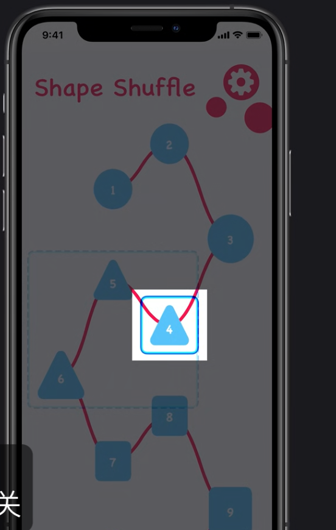
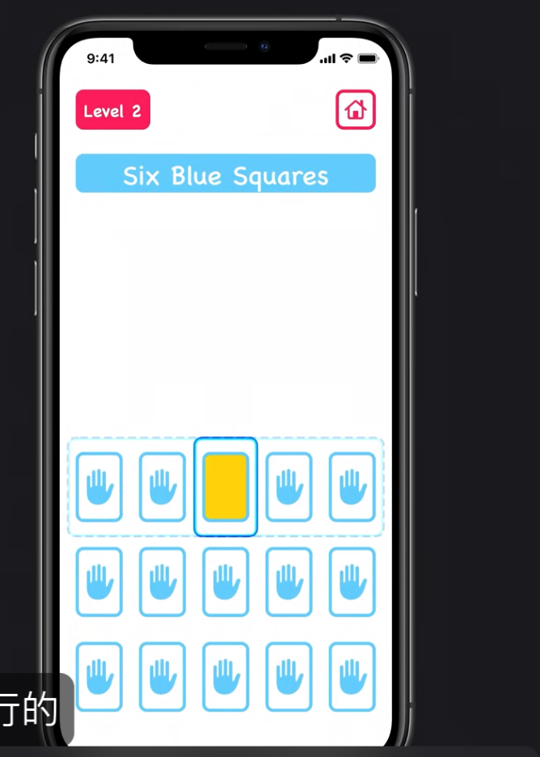

# Switch Control切换控制

帮助运动能力有限的人们控制iOS设备

他们大多使用外接的输入设备，可能通过吹起呼气或者外接按钮配合iPhone的移动光标来进行操作设备

可以在代码中设置accessibilityElements数组来自定义光标扫描顺序以帮助切换控制用户得到正确的光标扫描顺序

从代码层面，可以检测到光标扫描的动作，所以可以在光标扫描到元素的时候做一些操作。

可以使用UIAccessibilityCustomAction去自定义菜单类似上下文的东西，帮助切换控制用户进行手势操作

设计建议：

1. 破坏性行为确认：比如删除某些东西需要二次确认，因为访问控制用户会更容易按错

2. 不要设置时间限制：
3. 多分组，帮助他们更快找到自己的目标选项
4. 不要再用户界面长时间显示用户隐私或敏感信息，因为他们在轮椅上操作，所以会比较难遮挡