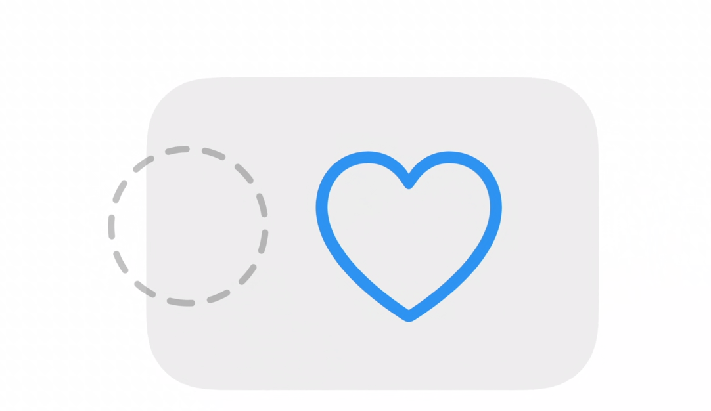
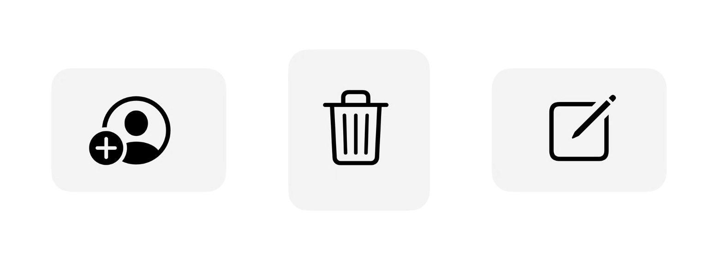
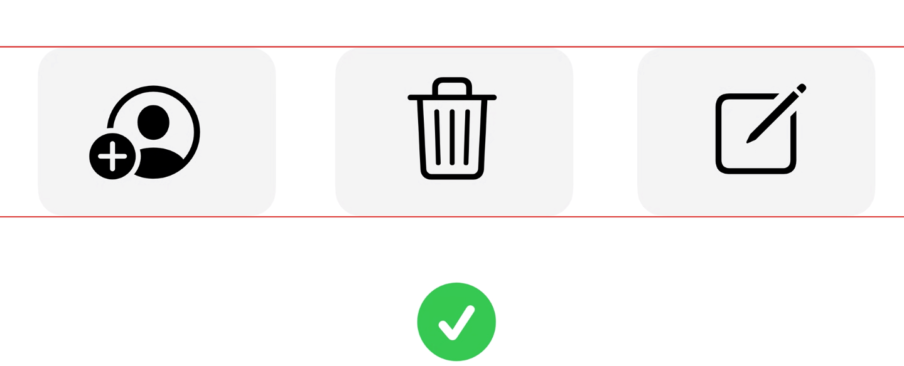

# iPadOS 光标设计

iPad光标比鼠标的精度更低，更好点击

光标会吸附可交互控件并凸显元素（而不会遮挡）

他会在文本上方知节变为I以告诉你目前他认为他在的地方

本质上是增加悬停可视化来帮助用户从细致的精度进入到粗精度

代码层是一个Model Pointer和一个RealPointer

Model Pointer用来指示你看到的指针位置————跟随软件（指向明确）

Real Pointer用来捕捉你移动的真实光标的位置————跟随系统（精度高）

手指抬起时会把RealPointer复位到ModelPointer

触摸板和屏幕交互不冲突，可以同时使用

对于一组的按钮最好让他们的悬停高亮的背景是一致的，如下图

悬停时可以增加阴影效果，变色效果，放大效果，或者更换光标样式（圆圈换成文本输入用的I光标或者左右箭头表示可以拖拽；变成十字形状指示更高精度的区域；按下Command变成）

具体情使用UIPointerShape的API

本质上就是用悬停时候的指针变化匹配用户意图传达可进行的操作

也可以增加上下文菜单匹配双指按下的展开上下文操作