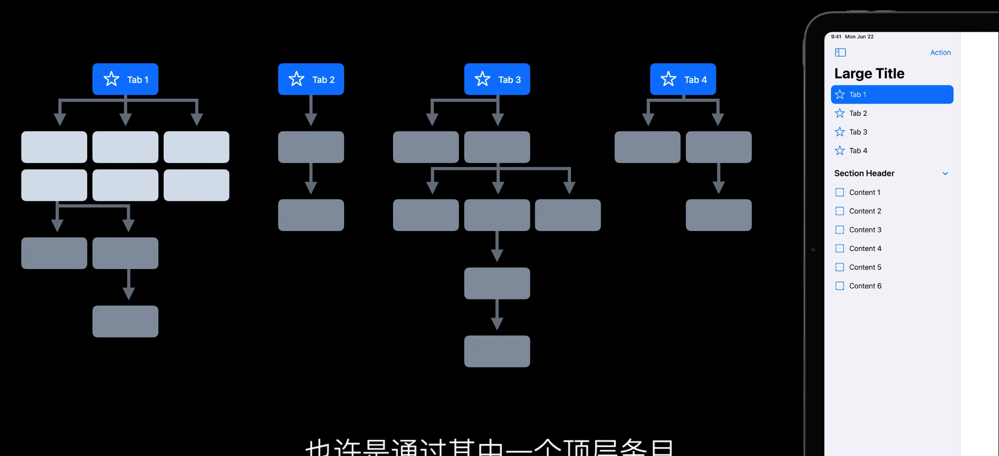

# iPad设计

Mac的目标是最大最完整，因为有精准的鼠标和键盘，但会限制人们的场景是坐在电脑前

iPhone的目标是便携和多点触控，不限制使用场景，但是输入不够精密

iPad介于两者中间，便携性强于Mac，操作精准性强于iPhone。便携性弱于iPhone，操作精准性弱于Mac，特点是有一个大屏幕

#### 技巧1: Flatten your navigation 扁平化导航栏

不要像iPhone一样全屏大导航，而是利用大屏幕让一屏看得完导航（例如：照片App左标签-右内容）

#### 技巧2: Show more content 展示更多内容

图标可以更小，不需要像iPhone一样那么大也可以被人们识别和点击

#### 技巧3: Stay in context保持上下文

让用户尽量多处在上下文中，用户会获取更多上下文信息，也会认为你的App更强大，例如可以多使用气泡弹框（日历日程中就在使用），

#### 技巧4：Create immersive experiences创造身临其境的体验

增加沉浸感，例如图片在中间，然后工具栏在左右两侧。

如果使用自定义输入框，记得支持Apple Pencil 作为输入方式

可以把键盘和触摸结合，例如按住command在点击，或者按住option再拖动

也可以将触摸和Pencil结合，例如Loom中左手按住出现托盘选择绘制动画的哪一帧，然后右手拿笔去选择笔触开始作画

千千：大屏小用或保持专注可能是他们认为的一种iPad的特色，因为演讲者距离了音乐App会让人沉浸在歌词里，而这是Mac所不具备的能力

#### 技巧5: Always stay responsive始终保持快速反应

无论是播放动画还是做什么，始终保持App可以被交互。例如iPad 的File打开菜单时仍然可以滚动，滚动时会自动关闭菜单并响应滚动

### 侧边栏

左侧边栏Sidebar在iPad中被大量使用，他们认为这是一种非常棒的交互方式，其他应用也可以借鉴这种交互模式。某些情况下使用三列布局也是没问题的，例如Mail，所有iPad OS 14种都已经提供。

对于比较扁平化的App，例如照片，音乐

对于层级比较深的App例如邮件

这两者都可以灵活使用侧边栏代替tabbar（例如在Regular时使用侧边栏代替tabbar，Compact时继续使用tabbar），可以在侧边栏种通过分类来增加层级

尽量不要在侧边栏种放超过一屏幕能显示完的东西，因为他是快捷入口嘛

 如果侧边栏是可以用户自定义的，那么在下面增加添加按钮是合理的

不要在此处深度嵌套，整个App的内容树不应该被挤进侧边栏，如果层级比较深，应当在右侧内容区尝试完成剩余部分。

紧凑布局的情况下保持下方toolbar，regular布局的时候可以把它挪到侧边栏上方

