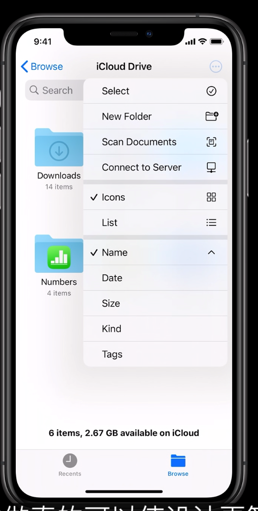

# 使用iOS选择器、菜单和操作进行设计

今天介绍三个控件

### Menu

随着iPhone屏幕变大，传统的Action sheet弹窗的表现不如Menu

每个Item左侧是一个Label，右侧是一个icon，菜单上方可以有一个title，中间可以增加Separator作为分隔符

不需要添加取消按钮，因为点击外面就可以取消

Menu菜单也可以用来消除歧义，例如用户保存视频，到底是保存覆盖当前的，还是创建新的

也可以让用户进一步选择目标，例如长按Safari中的返回按钮，会弹出所有可以返回的地方以供用户多层返回

也可以用来sort，用户选中一个之后就在后面打勾

也可以用来将一系列二级按钮放在一起

可以用Action sheet作为破坏性操作的提醒确认

Menu也很方便在Mac和iPad之间进行功能迁移

### Date and time Picker

车轮形状的滚动选择器将被Date，TimePicker替换掉

也提供了紧凑形的Picker，用户点一下就会pop一个视图给用户选择日期

### Color picker

一个颜色选择器，始终在左下角弹出，iPad和Mac都可用

