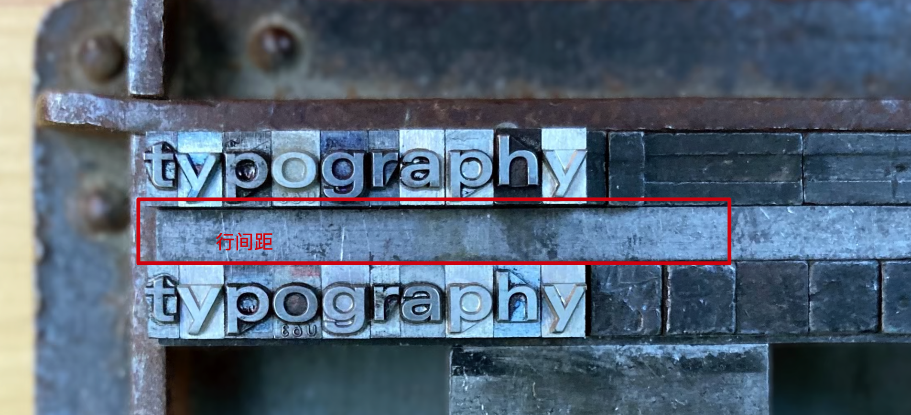

# WWDC20-用户界面字体排印详情

### Optical sizes视觉字号

过去的人们需要处理铅字在加工过程中产生的视觉偏差，现在的人们需要处理矢量图在像素网格上栅格化的挑战，可读性受很多细节决定

### Variable fonts可变字体

一个字型可以跟你急选择的每个字号自动适应而不是为每一个文字都搞一个类似图片的东西来存储，所以现在底层会用多个矢量运动轨迹来存储真正的文字，

字母和字母见的空间被叫做「边位」

「字偶距」用来更科学的让文本变得更密集而不是简单的「字间距」那样减少文本和文本你的间距

```swift
Text("hamburgefonstiv")
	.tracking(-0.5)
```

例如：


，当然，更科学的办法是让他自动收紧，使用allowsTightening(true)  API

例如

```swift
Text("hamburgefonstiv")
	.allowsTightening(true)
```

### Tracking and leading跟踪和领导

「行距」：指的是

「行高」：指的是真正文字和文字之间的距离

### Text styles and Dynamic Type文本样式和动态类型

SwiftUI中直接

```swift
let tightLeadingFootnoteFont = Font.footnote.leading(.tight)
```


