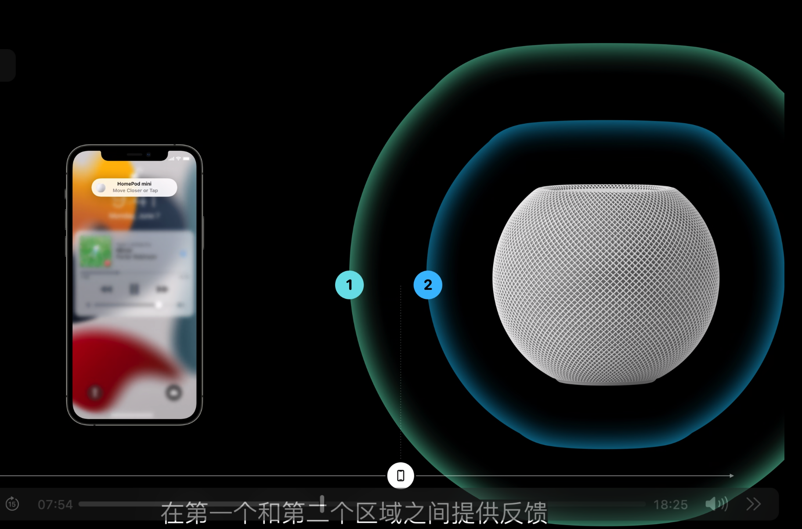

# 专为空间交互设计

空间感知使用U芯片定位

能感知到目标的方向和位置（例如Airtag）

距离较远时可以放宽箭头的范围，距离较近时可以通过震动来提示

可以根据距离来进行交互，例如进入范围1后干什么，进入范围2后干什么

可以综合视觉反馈，触觉反馈和声音反馈来对用户进行信息传达

请对各种人们可能出现的行动进行反馈，例如远离目标时

最重要的东西就应该最大，最不重要的东西就应该小，例如Airtag的箭头应该大

