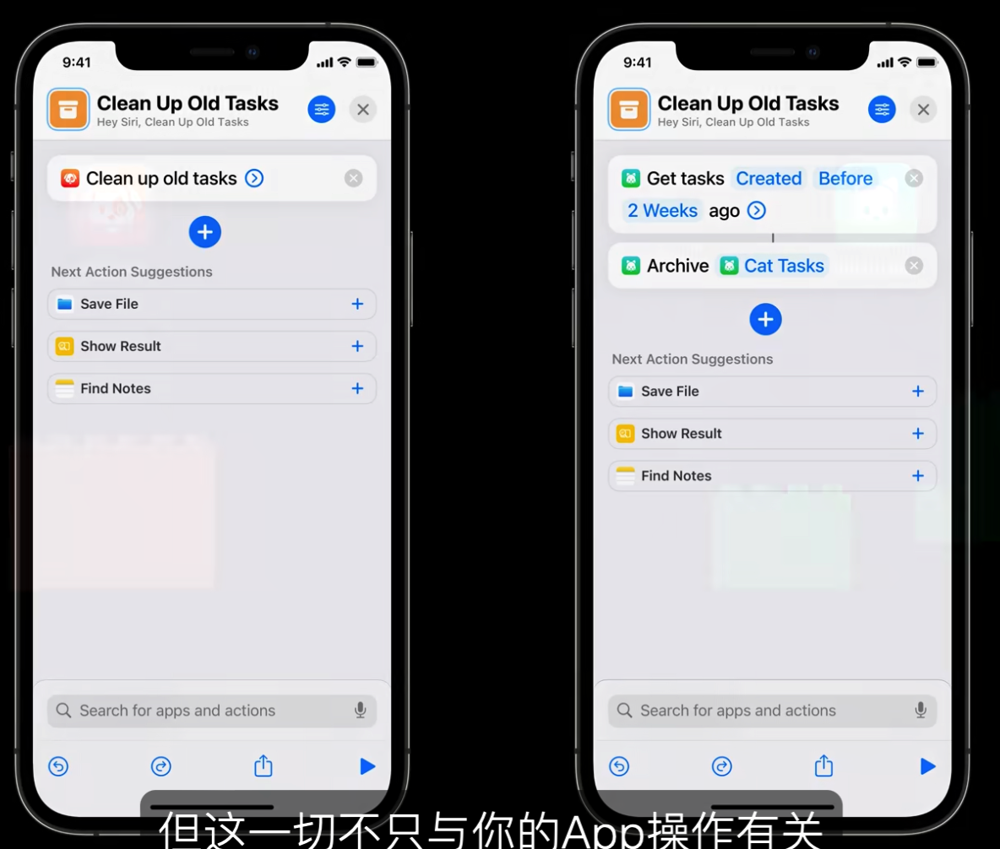

# 为快捷指令、Siri和建议设计出色的操作

本次的关注点在于不打开App界面的部分

首先作为App，预设用户会进行的Action，然后把用户的Action可以做成快捷指令

你可以将用户的行为「捐赠」给OS，Siri会自动学习人们使用App的方式，然后再适当的时间点在建议的小组件、搜索和锁屏界面上向用户建议某个Action，而用户此时就可以直接让Siri去做事儿

当用户以这种方式完成某些任务的时候，如果可以通过追问的方式完成任务就不要打开App

如果时间允许的话，你可以构建所有功能的快捷指令，但是如果时间有限的话，那么请为你认为最重要最核心的功能构建

优先提供更小原子的操作以供用户自己「拼图」，而不是一句话全部搞定（这样虽然提高了效率，但是定制性降低了）

让人们可以像搭积木一般组装原子shortcut

向用户的追问可能是在手机屏幕上显示，也有可能是在HomePod上播放，所以请写的像句子

在人们添加快捷指令到Siri后，可以让他们快速试用一下