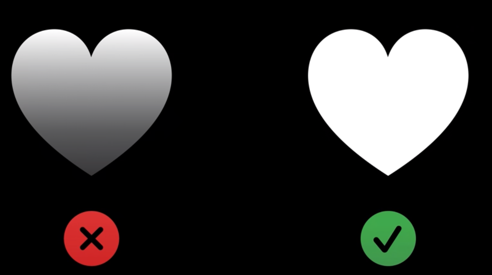

# 创建自定义符号

SF Symbol3

自定义符号使用SVG格式，包含排版信息，对齐信息、各种粗细版本等

增加多种调色方式（多色、单色等）

具体的操作文档可以查看[开发者文档-SF Symbols](developer.apple.com/sf-symbols/)

设计App可以使用Sketch、Illustrator，Figma

### 一些自定义符号的小技巧

路径应该这么搞

避免使用开放路径，因为会无法上色

避免使用渐变色，阴影等

着色时尽量选择系统颜色，因为他会自动适配黑暗模式

