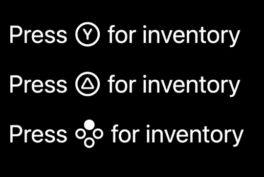
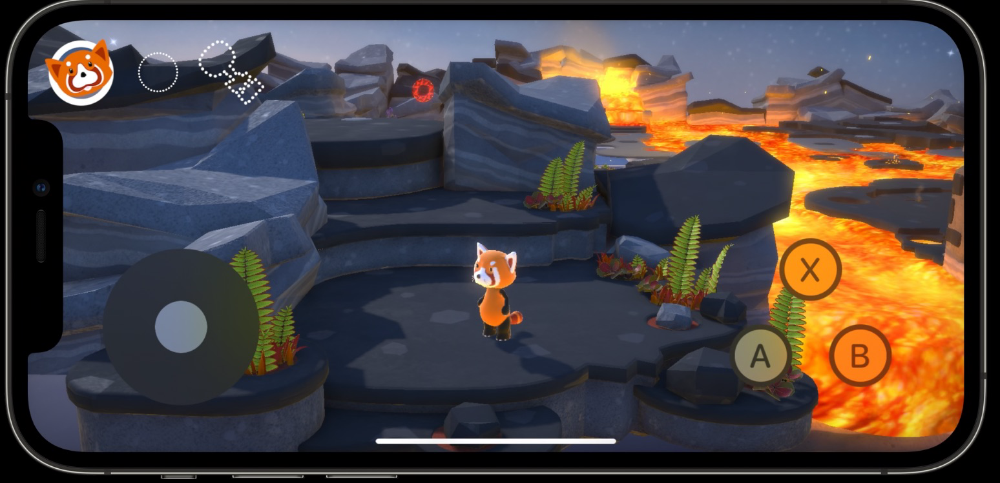

# 利用虚拟和物理游戏手柄

### Game conteoller recap游戏控制器回顾

GCDevice用来控制Controller，例如断开或者按下

GCController用来控制按钮

AppleStore会增加手柄支持的宣传在AppStore，要在Xcode中标记为Game Controllers可以操作

Apple会允许用户对Controllers在你的应用上做映射自定义（设置里）

请使用正确的手柄按键标识，例如XBox使用Y，PlayStation使用X，当然用上下左右的框框和实体标识就更棒了

### New virtual controller新的虚拟控制器

GCController对象会直接为你提供虚拟的控制器

记得增加手柄的震动反馈

### New controllers and features新控制器和功能

不同的外接控制器有特性，比如XBox的截图分享，比如某品牌有板机回馈，可以适配板机回馈阻力

记得允许用户分享视频录制，详见ReplayKit

